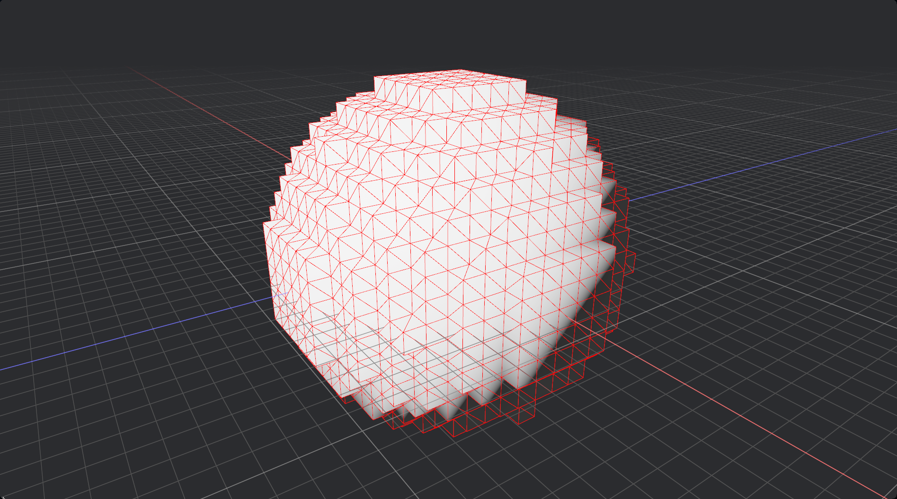

# Unfinished: Dual Contouring
An attempt at general purpose dual-contouring isosurface extraction, with the implementation being incomplete.

See a screenshot of the `sphere` example below. Run it yourself `cargo run --example sphere`.

References:
- https://www.boristhebrave.com/2018/04/15/dual-contouring-tutorial/
- https://dexyfex.com/2016/05/16/voxels-and-dual-contouring/
- https://dexyfex.com/2016/07/14/voxels-and-seamless-lod-transitions/
- https://github.com/nickgildea/fast_dual_contouring
- https://github.com/hmeyer/tessellation
- https://www.reddit.com/r/Unity3D/comments/ieenax/highaccuracy_dual_contouring_on_the_gpu_tech/
- https://www.mattkeeter.com/projects/contours/
- https://ngildea.blogspot.com/2015/06/dual-contouring-with-opencl.html
